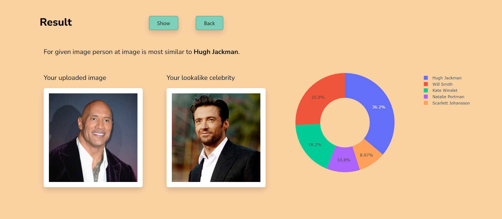

# Celebrity face classification
Celebrity Face App is a web application built with Django that was created to classify 17 famous faces based on their photos using the VGGFace2 model created by transfer learning and an endpoint for the model created in Azure.

The app's design and style were crafted using Bootstrap and CSS and decorated with images from [unDraw](https://undraw.co/).

Used [dataset](https://www.kaggle.com/datasets/vishesh1412/celebrity-face-image-dataset) is from Kaggle.

The model works with a given photo. The user selects the age group and gender of the person from the photo for the purposes of drawing a bar chart with the help of [Plotly](https://plotly.com/python/).

## Home Page

    </img>  

## Result Page

    </img>  

